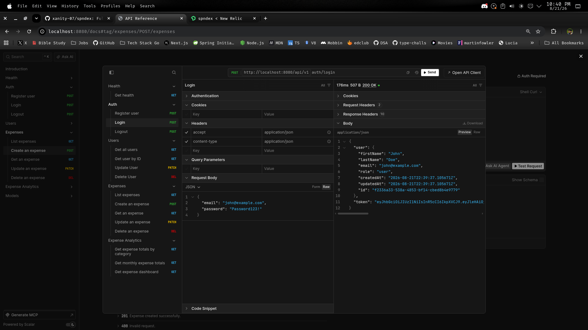

# Spndex

**Spndex is a budget management full-stack application currently under development.**

The project is built around a Go REST API with PostgreSQL, Redis, OpenAPI, and a TypeScript frontend.

> **Status:** Work in progress. The backend is currently the primary focus, while the frontend is being developed alongside it.



<!-- OPENAPI SCREENSHOT: GET /api/v1/expenses -->

<!-- OPENAPI SCREENSHOT: POST /api/v1/auth/login -->

<!-- OPENAPI SCREENSHOT: GET /api/v1/expenses/dashboard -->

## Tech Stack

* **Backend:** Go, Gin
* **Database:** PostgreSQL
* **Sessions:** Redis
* **Authentication:** JWT + Redis-backed sessions
* **API Contracts:** TypeScript, Zod, OpenAPI
* **Frontend:** TypeScript, React
* **Testing:** Go testing, Testcontainers
* **Observability:** New Relic, structured logging, distributed tracing
* **Infrastructure:** Docker

---

## Architecture

The backend follows a layered architecture designed to keep HTTP handling, business logic, and data access separate.

```text
HTTP Request
     │
     ▼
   Router
     │
     ▼
 Middleware
     │
     ▼
  Handler
     │
     ▼
  Service
     │
     ▼
 Repository
     │
     ├───────────────┐
     ▼               ▼
PostgreSQL         Redis
```

### Router

Responsible for registering versioned API routes and connecting routes to middleware and handlers.

Example:

```text
/api/v1/auth
/api/v1/users
/api/v1/expenses
/api/v1/expenses/dashboard
```

### Middleware

Handles cross-cutting concerns such as:

* Authentication
* Request IDs
* Request context
* Distributed tracing
* Request logging

### Handlers

The HTTP layer is responsible for:

* Binding requests
* Request validation
* Calling services
* Returning HTTP responses
* Translating application errors into API responses

Business logic is kept out of the handlers.

### Services

Services contain the application's business rules.

They operate through repository interfaces rather than directly accessing PostgreSQL or Redis.

This makes the business logic independently testable without requiring external infrastructure.

### Repositories

Repositories handle data access and infrastructure operations.

PostgreSQL is used for persistent application data while Redis is used for session storage.

---

## Authentication

Authentication uses JWT access tokens combined with Redis-backed sessions.

```text
Login
  │
  ├── Validate credentials
  │
  ├── Create Redis session
  │
  └── Generate JWT
          │
          ▼
      API Request
          │
          ▼
    Authentication
      Middleware
          │
          ├── Validate JWT
          └── Validate session
```

Logging out deletes the Redis session, allowing an otherwise valid JWT to be invalidated before its expiration.

---

## API Contracts

API schemas are maintained in shared TypeScript packages within the monorepo.

```text
packages/
├── zod/
│   ├── auth.ts
│   ├── users.ts
│   ├── expense.ts
│   ├── expenseAnalytics.ts
│   ├── errors.ts
│   └── health.ts
│
└── openapi/
    ├── gen.ts
    ├── index.ts
    └── utils.ts
```

The Zod package contains shared schemas for API requests and responses.

The OpenAPI package uses these contracts to generate the API specification used for documentation.

This keeps API contracts centralized rather than defining them independently in different parts of the project.

---

## Testing

The project uses different testing strategies depending on the layer.

### Service Tests

Service tests use fake repositories to isolate business logic from infrastructure.

```text
Service
   │
   ▼
Fake Repository
```

This makes it possible to test validation, business rules, and error handling without requiring a database or Redis instance.

### Repository Tests

Repository tests use real PostgreSQL and Redis instances through Testcontainers.

```text
Repository
    │
    ├── PostgreSQL Container
    │
    └── Redis Container
```

This allows the tests to verify actual SQL queries, database constraints, Redis operations, serialization, filtering, soft deletion, and analytics queries.

The test infrastructure is shared under:

```text
apps/backend/internal/tests/
├── postgres.go
├── redis.go
├── schema.go
└── test_helpers.go
```

---

## Observability

New Relic is integrated into the backend for application observability.

The backend also uses structured logging and request IDs to make requests easier to trace across application layers.

Tracing and logging are implemented through middleware rather than individual handlers.

---

## Project Structure

```text
spndex/
│
├── apps/
│   ├── backend/
│   │   └── internal/
│   │       ├── auth/            # JWT authentication
│   │       ├── config/          # Application configuration
│   │       ├── database/        # PostgreSQL, Redis, migrations
│   │       ├── enums/           # Application enums
│   │       ├── errs/            # Application/HTTP errors
│   │       ├── handlers/        # HTTP layer
│   │       ├── loggerpkg/       # Logging
│   │       ├── middleware/      # Auth, tracing, context, request IDs
│   │       ├── model/           # Application models
│   │       ├── repositories/    # Data access
│   │       ├── router/          # Route registration
│   │       ├── server/          # Server lifecycle
│   │       ├── service/         # Business logic
│   │       ├── sqlerr/          # SQL error handling
│   │       ├── tests/           # Integration test infrastructure
│   │       └── validation/      # Validation
│   │
│   └── web/                     # React frontend (work in progress)
│
├── packages/
│   ├── zod/                     # Shared API schemas
│   └── openapi/                 # OpenAPI generation
│
├── package.json
├── pnpm-workspace.yaml
└── README.md
```

---

## Current Features

* User registration and authentication
* JWT authentication
* Redis-backed sessions
* User management
* Expense creation and management
* Soft deletion
* Expense filtering and pagination
* Expense analytics
* Category spending totals
* Monthly spending
* Spending trends
* Dashboard statistics
* OpenAPI documentation
* Structured application errors
* Request tracing and logging
* PostgreSQL integration tests
* Redis integration tests
* Service unit tests with repository fakes

## In Progress

Spndex is still under active development.

Current work includes:

* Frontend application
* Additional API functionality
* Rate limiting
* Additional test coverage
* Continued API and architecture improvements

## Why I Built This

Spndex started as a budget management application but has evolved into a project for exploring production-oriented backend architecture.

The main focus has been designing clear boundaries between HTTP handling, business logic, data access, authentication, infrastructure, testing, and observability while keeping the system maintainable as it grows.
